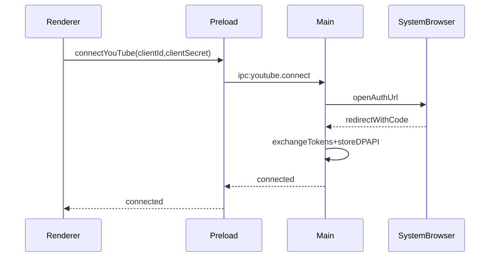

## Scope and assumptions

- Build through **M3**: skeleton + DPAPI storage + YouTube OAuth/import.
- **YouTube-only** for v1 initial build; Apple import deferred.
- Implement read-only flows and settings-driven credentials per requirements.

## Proposed architecture (aligned to plan/spec)

- **Main process**: app lifecycle, OAuth loopback server, YouTube provider, encrypted token storage.
- **Preload**: minimal `window.api` surface for connect, list playlists, import playlist.
- **Renderer**: Settings (credentials + connect), Import/Select (left/right YouTube selection), basic status UI.

## Implementation plan

1. **Scaffold app shell**

   - Initialize Electron Forge + Vite + React + TS in repo root.
   - Create project layout in `src/` per plan.
   - Add a minimal window + routing placeholder for Settings/Import screens.
   - Files: [`src/main/`](src/main/), [`src/preload/`](src/preload/), [`src/renderer/`](src/renderer/), plus `package.json` and Forge/Vite config.

2. **Define IPC contracts and preload bridge**

   - Add typed IPC channels for YouTube connect/list/import and settings CRUD.
   - Expose `window.api` methods in preload with strict input validation.
   - Files: [`src/ipc/channels.ts`](src/ipc/channels.ts), [`src/preload/index.ts`](src/preload/index.ts).

3. **Implement encrypted settings + token storage (DPAPI)**

   - Persist settings (clientId/secret) and YouTube tokens under Electron `userData`.
   - Use Windows DPAPI to encrypt/decrypt token file per requirements.
   - Files: [`src/storage/secureStore.ts`](src/storage/secureStore.ts), [`src/storage/settingsStore.ts`](src/storage/settingsStore.ts).

4. **YouTube OAuth (loopback) + playlist import**

   - Start loopback server at `http://127.0.0.1:17600/callback`.
   - Build auth URL with required scopes; exchange code for tokens.
   - List playlists and import playlist items via YouTube Data API v3.
   - Normalize to a basic `NormalizedTrack` shape to hand back to renderer.
   - Files: [`src/providers/youtube/oauth.ts`](src/providers/youtube/oauth.ts), [`src/providers/youtube/api.ts`](src/providers/youtube/api.ts), [`src/domain/types.ts`](src/domain/types.ts).

5. **Renderer flows (Settings + Import)**

   - Settings: inputs for clientId/secret, connect/disconnect status.
   - Import: list playlists for Left/Right selection and trigger import.
   - Files: [`src/renderer/routes/Settings.tsx`](src/renderer/routes/Settings.tsx), [`src/renderer/routes/Import.tsx`](src/renderer/routes/Import.tsx).

6. **Lightweight tests and smoke steps**

   - Unit tests for DPAPI store read/write and token expiry handling.
   - Manual smoke: connect → list playlists → import.

## Notes

- Apple import remains deferred (per your selection).
- Matching/compare/export will be built in later milestones.